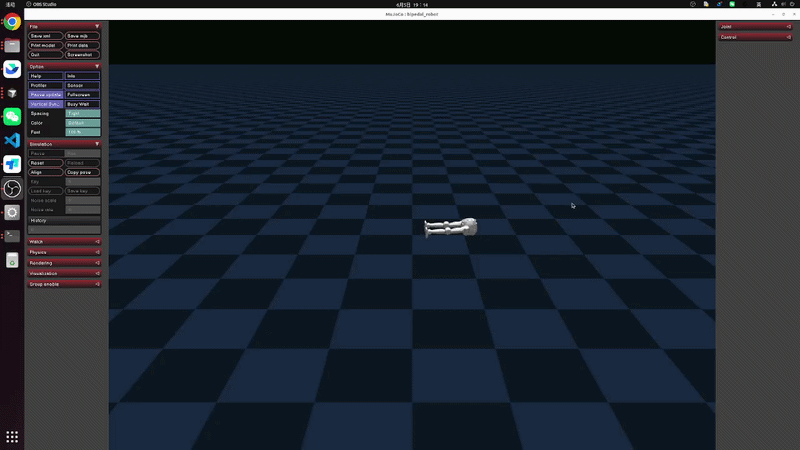
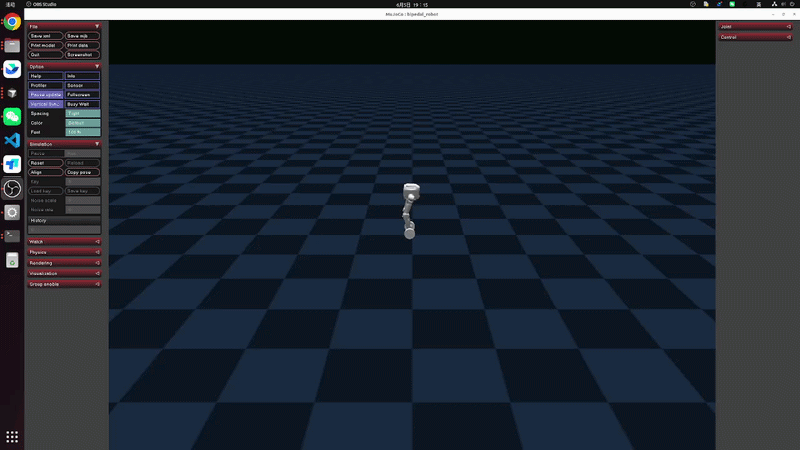

<!--
  SPDX-FileCopyrightText: 2024-2026 LimX Dynamics Technology Co., Ltd.
  SPDX-License-Identifier: Apache-2.0
-->

# tron2-rl-deploy-python 使用说明

[English](README.md) | [中文](README_zh-CN.md)

> **发布渠道。** 本仓库的主发布点为 GitHub：
> <https://github.com/limx-tron2/tron2-rl-deploy-python>。
> LimX 内部 GitLab 为镜像；Issue、PR 与安全报告请提交到 GitHub。

面向 TRON2A 人形机器人（足底 `SF_TRON2A`、单臂足式 `SFYG_TRON2A`、
轮足 `WF_TRON2A` 与双臂足式 `DASF_TRON2A`）的
强化学习**部署 / 推理**栈（Python 实现）。通过 `onnxruntime` 加载 ONNX
策略，经 LimX 底层 SDK 下发关节目标，既可对接 MuJoCo 仿真，也可用于实机部署。

## 许可与归属

本项目采用 **Apache License, Version 2.0**（2004 年 1 月）开源协议，
完整条款请见 [`LICENSE`](LICENSE) 文件。SPDX 标识：`Apache-2.0`。

- [`NOTICE`](NOTICE) — 必要的归属声明。
- [`THIRD_PARTY_NOTICES.md`](THIRD_PARTY_NOTICES.md) — 已签入 ONNX
  权重、`limxsdk-lowlevel` 子模块、Python 运行依赖（`onnxruntime`、
  `numpy`、`scipy`、`pyyaml`、`pygame`）以及文档媒体的逐项来源说明。
- [`MODEL_CARD.md`](MODEL_CARD.md) — `controllers/model/` 下全部六个
  SF/WF/DASF ONNX 模型的模型卡。
- [`SECURITY.md`](SECURITY.md) — 漏洞上报流程及实机安全须知。
- [`CONTRIBUTING.md`](CONTRIBUTING.md) — 开发环境（`pip`、`ruff`）、
  验证步骤、DCO 签署与模型来源规则。
- [`CHANGELOG.md`](CHANGELOG.md) — 版本变更记录以及待相关负责人
  签署确认的事项。

## 适用范围与除外

本仓库**包含**：

- Python 控制器入口 (`main.py`) 与分形态控制器
  (`controllers/SolefootController.py`、
  `controllers/WheelfootController.py`、
  `controllers/DASFController.py`)。
- 运行时配置 (`controllers/model/*/params.yaml`)。
- 六个 ONNX 推理文件（`SF_TRON2A`、`WF_TRON2A` 与
  `DASF_TRON2A` 的 `policy.onnx`、`encoder.onnx`）——**来源确认待签署**，
  详见
  [`MODEL_CARD.md`](MODEL_CARD.md) 及
  [`THIRD_PARTY_NOTICES.md`](THIRD_PARTY_NOTICES.md) 第 2 节。
- 供应商 SDK **子模块引用** (`limxsdk-lowlevel/`) ——
  **SDK 责任方 / 法务确认待签署**，未获书面签署前请勿变动 pin。

本仓库**不包含**（按设计）：

- 不包含 PyTorch / 训练权重（`.pt`、`.pth`、`.ckpt`、`.safetensors`）。
- 不包含 SDK 二进制（`.so`、`.dll`、`.dylib`、`.lib`、`.whl`）——请自行
  从内置的 `limxsdk-lowlevel/` 子模块安装 LimX SDK wheel。
- 不包含固件、出厂标定值或按序列号的标定文件。
- 不包含 rosbag / MCAP / 轨迹回放。
- 不包含客户或现场专属配置。
- **不预置机器人 IP。** 下方第 4 章示例中的 `<robot-ip>` 是
  **占位符**——运行前请替换为您自己机器人或仿真器的实际 IP。
  本仓库源码不包含任何硬编码的私网地址。仅内部使用的姊妹仓库
  `tron2-rl-deploy-ros` 在其源码 / launch 文件中保留了一处
  作为文档示例的字面量 `10.192.1.2`，该情况已在该仓库的
  `SECURITY.md` 中声明；本仓库有意不含此类字面量。

> **实机安全提示。** 本仓库**并非仅供仿真使用**。`main.py`
> 会向您指定的 IP 打开 SDK 连接，控制器会下发关节力矩，真实机器人会实际执行。
> DA-SF 通过 Centaur SDK 同时控制上下身通道。
> 在将本代码指向物理设备之前，请务必阅读
> [`SECURITY.md`](SECURITY.md#real-hardware-safety-notice)。

## 1. 目录结构

- `main.py`：控制器入口程序（根据 `ROBOT_TYPE` 自动选择 SF/WF/DA-SF 控制器）。
- `controllers/SolefootController.py`：`SF_TRON2A` 推理与控制逻辑。
- `controllers/WheelfootController.py`：`WF_TRON2A` 推理与控制逻辑。
- `controllers/DASFController.py`：`DASF_TRON2A` 推理与控制逻辑。
- `controllers/SFYGController.py`：10维腿部RL、6维OCS2机械臂和2维夹爪的
  18关节组合控制器。
- `controllers/sfyg_contract.py`：42维本体观测、30维future wrench与52列OCS2
  轨迹契约。
- `controllers/model/<ROBOT_TYPE>/`：每种机型的模型与配置文件目录。
- `limxsdk-lowlevel/`：LimX SDK 及示例代码。

## 2. 环境准备

### Step 1: 安装 Python 依赖

```bash
pip install -U pip
pip install numpy scipy pyyaml onnxruntime pygame
```

### Step 2: 安装 LimX SDK（必须）

按你的系统架构安装 wheel：

```bash
git clone https://github.com/limxdynamics/limxsdk-lowlevel.git

# x86_64 示例
pip install limxsdk-lowlevel/python3/amd64/limxsdk-*-py3-none-any.whl

# aarch64 示例
pip install limxsdk-lowlevel/python3/aarch64/limxsdk-*-py3-none-any.whl
```

## 3. 模型文件放置规则

模型文件需要按机型放在：

- `controllers/model/SF_TRON2A/policy.onnx`
- `controllers/model/SF_TRON2A/encoder.onnx`
- `controllers/model/SF_TRON2A/params.yaml`
- `controllers/model/WF_TRON2A/policy.onnx`
- `controllers/model/WF_TRON2A/encoder.onnx`
- `controllers/model/WF_TRON2A/params.yaml`
- `controllers/model/DASF_TRON2A/policy.onnx`
- `controllers/model/DASF_TRON2A/encoder.onnx`
- `controllers/model/DASF_TRON2A/params.yaml`
- `controllers/model/SFYG_TRON2A/params.yaml`
- `controllers/model/SFYG_TRON2A/encoder.onnx`（`420→3`，待WholeBody导出）
- `controllers/model/SFYG_TRON2A/policy.onnx`（`78→10`，待WholeBody导出）

SFYG输入顺序固定为 `encoder(3) + proprioception(42) + future wrench(30) +
command(3)`。普通 `48→10` policy不兼容，控制器会拒绝错误维度。

## 4. 运行控制器

### Step 1: 进入目录并设置机型

```bash
cd tron2-rl-deploy-python
export ROBOT_TYPE=SF_TRON2A
或 export ROBOT_TYPE=WF_TRON2A
或 export ROBOT_TYPE=DASF_TRON2A
或 export ROBOT_TYPE=SFYG_TRON2A
```

### Step 2: 启动控制器

默认连接本机仿真（`127.0.0.1`）：

```bash
python3 main.py
```

指定机器人或 SDK 目标 IP：

```bash
# 说明：<robot-ip> 是占位符，运行前请替换为您自己机器人 /
# 仿真器的实际 IP。本仓库源码未硬编码任何私网地址。
# （仅内部使用的姊妹仓库 tron2-rl-deploy-ros 在其源码 /
# launch 文件中保留了作为文档示例的字面量 10.192.1.2，
# 已在该仓库的 SECURITY.md 中声明。）
python3 main.py <robot-ip>
```

SFYG可先不接OCS2，用固定速度命令验证行走。当前checkpoint在行走分布内稳定，
但精确零速度命令下不能可靠保持平衡，因此建议先使用前进命令：

```bash
export ROBOT_TYPE=SFYG_TRON2A
python3 main.py 127.0.0.1 --start-controller --base-command 0.5 0 0
```

随后可使用WholeBody Lab导出的52列OCS2轨迹：

```bash
export ROBOT_TYPE=SFYG_TRON2A
python3 main.py 127.0.0.1 --ocs2-trajectory /path/to/trajectory.csv --start-controller
```

控制器以500Hz发布18维带关节名的 `RobotCmd`，每10周期以50Hz更新encoder、policy
和OCS2采样。未加 `--start-controller` 时仅安全保持；不提供轨迹时，控制器使用
`--base-command VX VY WZ` 的固定速度命令及零future wrench。速度命令范围为
`|vx|<=1`、`|vy|<=0.5`、`|wz|<=1.5`。

## 5. 与 MuJoCo 仿真联调

请确保仿真端和控制端使用相同的 `ROBOT_TYPE`：

- 仿真端：`tron2-mujoco-sim/simulator.py`
- 控制端：`tron2-rl-deploy-python/main.py`

建议先启动仿真，再启动控制器。

DA-SF 使用 `tron2-mujoco-sim/simulator.py`，控制端仍通过统一入口启动：

```bash
export ROBOT_TYPE=DASF_TRON2A
python3 main.py
```

DA-SF 的上下身电机状态、命令、IMU 和远端手柄均通过 Centaur SDK 收发。
控制器默认通过 pygame 直接读取 F710；未安装 pygame 或未检测到手柄时，
自动回退到 SDK `SensorJoy`。默认 IP `127.0.0.1` 连接本机仿真，指定非回环
机器人 IP 时强制启用真机关节坐标变换（大腿 yaw 零位偏移、膝和踝 pitch
方向反转）。本地回环 MuJoCo 不执行该变换。

## 6. 手柄控制说明

- `L1 + Y`：切换到 WALK
- `L1 + X`：切回 IDLE
- `R1`：清空速度指令和策略历史

F710 背面切换到 `X` 模式并连接后，直接运行 `main.py`。启动日志出现
`Direct joystick ready: Logitech Gamepad F710` 表示已启用直连，不需要
运行 `robot-joystick`。

如果日志显示 `Joystick source: limxsdk SensorJoy`，可另开终端运行手柄发布器：

```
../tron2-mujoco-sim/robot-joystick/robot-joystick
```

控制器完成默认姿态插值后，按 `L1 + Y` 启动策略。三个手柄轴按照
`controllers/model/DASF_TRON2A/params.yaml` 中的 `commands.max` 缩放。

## 7. 效果展示

### MuJoCo 仿真部署 (Simulation)





### 实机部署 (Real-world)

实机部署时请悬挂启动控制器


## 8. 常见问题

- `ROBOT_TYPE not set`：先执行 `export ROBOT_TYPE=...`
- `Model not found`：检查 `controller/model/<ROBOT_TYPE>/` 下文件是否齐全
- `No module named limxsdk`：SDK wheel 未安装到当前 Python 环境
- `RobotState has not been received yet`：通常是仿真器未启动，或两端 `ROBOT_TYPE` 不一致

---

## 验证

下列命令与 CI 使用的一致（参见
[`.github/workflows/ci.yml`](.github/workflows/ci.yml)），在提 PR 前
本地跑一遍可减少来回。它们都不需要真机。

```bash
# 1. 对所有 Python 文件进行字节码编译（捕获语法错误，
#    无需安装 SDK wheel）。
python -m compileall -q main.py controllers/

# 2. Lint（推荐）。
pip install ruff
ruff check .

# 3. 空跑导入 —— 触发模块级副作用但不调用 robot.init。
#    需要已安装 LimX SDK wheel。
python -c "import controllers"

# 4. 校验所有 params 文件的 YAML。
python -c "import yaml, glob
for p in glob.glob('controllers/model/*/params.yaml'):
    yaml.safe_load(open(p)); print('OK', p)"

# 5. 校验 ONNX（仅加载图结构，不做推理）。
python -c "import onnx, glob
for p in glob.glob('controllers/model/*/*.onnx'):
    onnx.checker.check_model(onnx.load(p)); print('OK', p)"
```

### 仅仿真模式

在接入真机之前，请先在 LimX MuJoCo 仿真中完整验证控制回路：

1. 使用与实际部署相同的 `ROBOT_TYPE` 启动仿真
   (`tron2-mujoco-sim/simulator.py`)。
2. 保持控制器目标 IP 为默认 `127.0.0.1`（`main.py` 在不带参数运行时
   即使用该值）。
3. 运行 `python3 main.py`，确认观测数据流、动作输出与手柄绑定在
   仿真中均符合预期。

只有在仅仿真验证通过后，才可考虑实机运行——并且必须按
[`SECURITY.md`](SECURITY.md#real-hardware-safety-notice) 要求，
在机器人悬挂 / 支撑状态下进行。

---

## 引用与支持

如在学术或公开工作中使用本部署栈，请按下述格式引用本仓库：

```
@misc{limx_tron2_rl_deploy_python_2026,
  title  = {tron2-rl-deploy-python: TRON2 RL deployment (Python)},
  author = {LimX Dynamics},
  year   = {2026},
  howpublished = {\url{https://github.com/limx-tron2/tron2-rl-deploy-python}}
}
```

- **Bug 反馈 / 特性请求：**
  [GitHub Issues](https://github.com/limx-tron2/tron2-rl-deploy-python/issues)。
- **使用问题 / 集成咨询：**
  [GitHub Discussions](https://github.com/limx-tron2/tron2-rl-deploy-python/discussions)。
- **安全漏洞 / 机器人安全事件：** 邮件至
  `contact@limxdynamics.com`；详见 [`SECURITY.md`](SECURITY.md)。
- **公司 / 商务联系：** <https://www.limxdynamics.com>。
